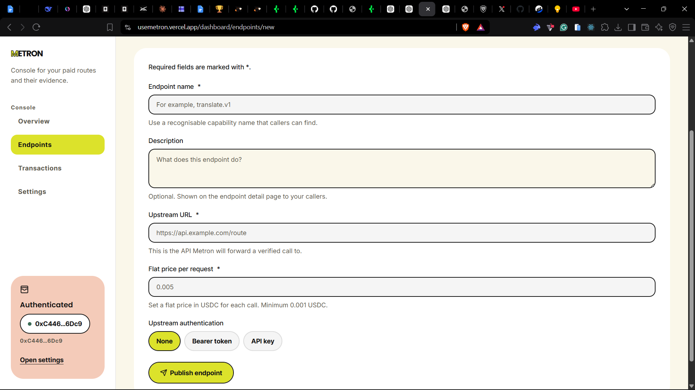
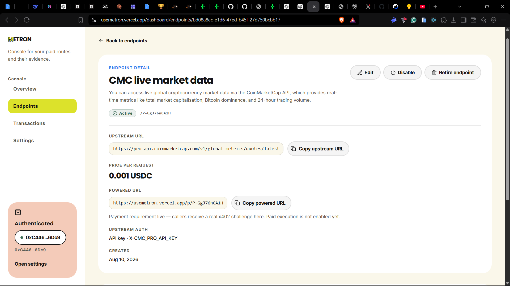
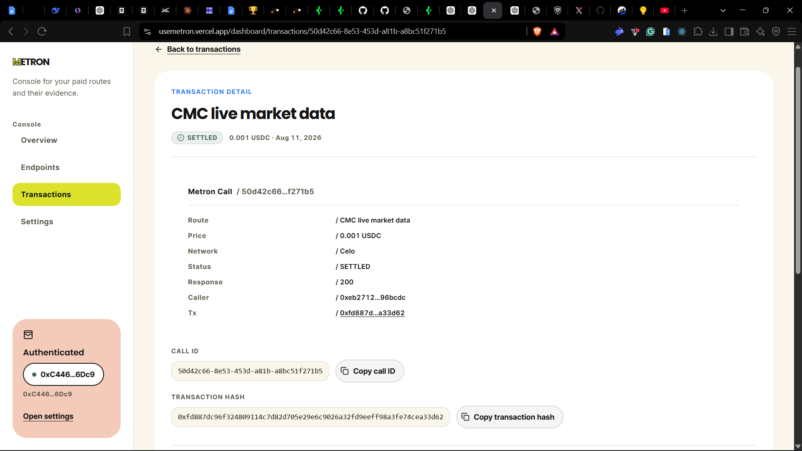
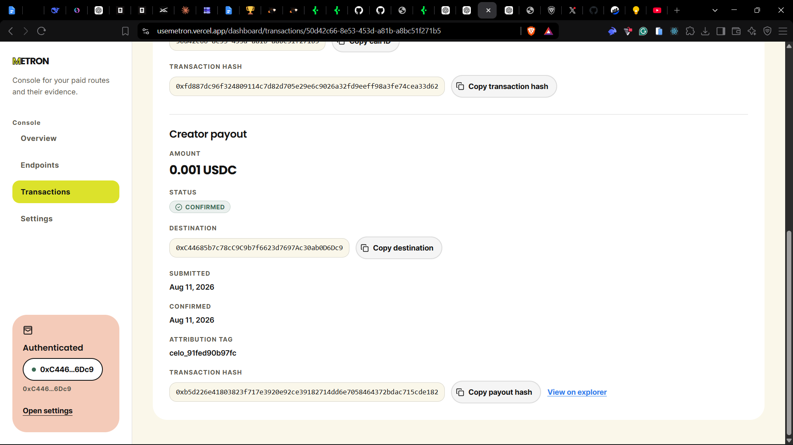
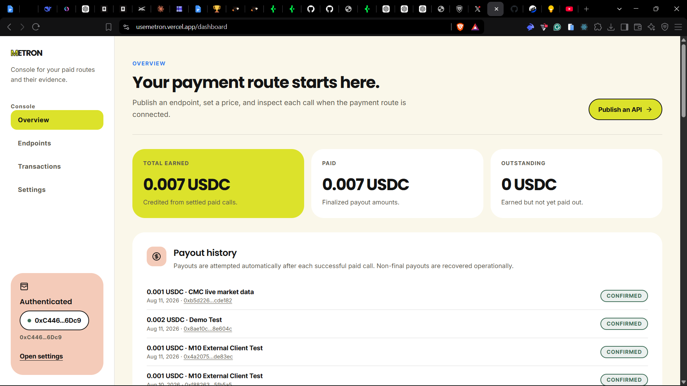
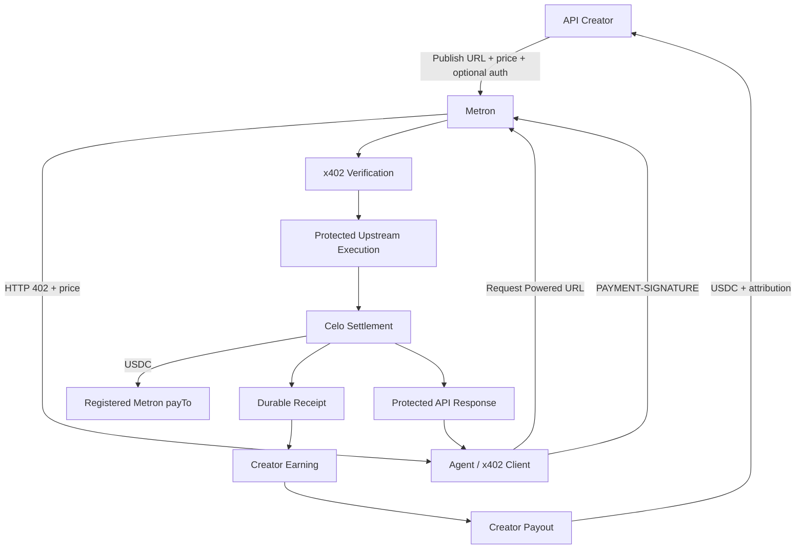

# Metron

### Turn API calls into paid work.

**One call. One price. One settlement.**

Metron lets developers turn an existing API into a pay-per-request service that software and AI agents can purchase with USDC through x402 on Celo.

You bring the API.

Set what one request costs.

Metron handles the payment requirement, verification, protected execution, settlement evidence, creator accounting and payout.

**Live:** [usemetron.vercel.app](https://usemetron.vercel.app)

**Network:** Celo Mainnet
**Payment protocol:** x402 V2
**Asset:** USDC


---

## The Problem

APIs are built around an old assumption:

**the customer is a person or company that wants an ongoing subscription.**

So using an API usually means:

1. create an account;
2. choose a plan;
3. add billing;
4. receive an API key;
5. manage usage;
6. pay again next month.

That works when a team plans to use an API every day.

It works much less naturally when **software itself is the customer**.

An AI agent might need:

* one market price;
* one inference;
* one search result;
* one research request;
* one data lookup;
* one API action;

…and then move on.

It should not need a monthly subscription just to buy one useful piece of work.

---

# With Metron

A developer can take an API they already run and publish a paid route around it.

The creator chooses:

* the upstream API;
* the price per request;
* whether that upstream uses no authentication, a Bearer token, or an API key.

Metron gives them a **Powered URL**.

When an agent or x402-compatible client calls that URL:

```text
request
  ↓
HTTP 402 + exact price
  ↓
USDC payment authorization
  ↓
verification
  ↓
real upstream API execution
  ↓
Celo settlement
  ↓
protected result
  ↓
creator earning + payout
```

The caller gets the result it paid for.

The API creator gets paid for the work that was actually consumed.

No subscription is required.

---

# How You Can Earn With Metron

If you already have access to something useful through an API, Metron gives you a way to sell access **one request at a time**.

Examples:

| You have                      | You could sell                                 |
| ----------------------------- | ---------------------------------------------- |
| AI model or inference service | One generation or inference                    |
| Financial/data API            | One quote, lookup or dataset query             |
| Search infrastructure         | One search result                              |
| Research service              | One research request                           |
| Scraper                       | One extraction                                 |
| Analytics service             | One report or calculation                      |
| Developer tool                | One execution                                  |
| Existing SaaS API             | Individual capabilities without a subscription |

You do **not** need to rebuild the API around crypto payments.

Metron sits in front of it.

> Metron does not guarantee earnings. It gives creators infrastructure to price and sell API requests directly to compatible callers and agents.

---

# Publish Your First Paid API

## 1. Open Metron

Go to:

**https://usemetron.vercel.app**

Connect your wallet and authenticate.

Your wallet becomes your creator identity and payout destination.

---

## 2. Publish an endpoint

Open:

**Dashboard → Endpoints → Publish endpoint**

Provide:

### Endpoint name

A human-readable name for what the API does.

Example:

```text
Crypto Market Price
```

### Upstream URL

The real API Metron should call after payment succeeds.

Example:

```text
https://api.example.com/v1/price
```

### Price

Choose the amount of USDC charged for one request.

Example:

```text
0.001 USDC
```

The current minimum is `0.001 USDC`.

### Upstream authentication

Metron supports:

* **None**
* **Bearer token**
* **API Key**

For an API-key authenticated service, you provide both the header name and secret value.

For example:

```text
Header:
X-CMC_PRO_API_KEY

Value:
your-secret-api-key
```

The secret is encrypted before persistence and is never returned through the normal endpoint APIs after saving.



---

## 3. Get your Powered URL

After publishing, Metron gives the route its own production URL:

```text
https://usemetron.vercel.app/p/{slug}
```

This is the URL callers pay to access.

You keep operating your original upstream API.

Metron operates the paid route in front of it.



---

# What Happens When Someone Calls It?

An ordinary unpaid request receives:

```http
HTTP/1.1 402 Payment Required
PAYMENT-REQUIRED: ...
```

The requirement contains the real route price and Celo payment details.

An x402-compatible client can then authorize the payment and retry the same request.

Metron:

1. validates the payment payload;
2. prevents authorization replay;
3. verifies it through the Celo x402 facilitator;
4. executes the configured upstream API;
5. settles the successful paid request;
6. records a durable receipt;
7. credits the creator;
8. attempts the creator payout;
9. returns the protected upstream response.

The caller does **not** need a Metron account.

It only needs to understand x402.

---

# The Economic Loop

Metron intentionally keeps the x402 settlement and creator payout as two explicit financial legs.

```text
CALLER / AGENT
      │
      │ x402 USDC settlement
      ▼
REGISTERED METRON payTo
      │
      │ separate attributed payout
      ▼
API CREATOR
```

The x402 payment first settles through Metron's registered Celo payment wallet.

A creator earning is then recorded for the successful paid call.

Metron attempts a separate USDC payout to the creator associated with that endpoint.

A payout problem never causes the successful caller to be charged again or reruns the creator's API.

---

# Real Celo Mainnet Proof

Metron's core economic loop has been executed on **Celo Mainnet with real USDC**.

## External x402 payment

**Amount:** `0.001 USDC`
**Result:** `SETTLED`
**Upstream:** `HTTP 200`

Transaction:

[`0x821dd6c12157f03aae18948c89a4c7046cd609eb136d52ddad64c57195b54a3a`](https://celo.blockscout.com/tx/0x821dd6c12157f03aae18948c89a4c7046cd609eb136d52ddad64c57195b54a3a)



## Automatic creator payout

**Amount:** `0.001 USDC`
**Result:** `CONFIRMED`
**Attribution:** `celo_91fed90b97fc`

Transaction:

[`0xa89d119600bfe366aeff364926546c626d6d04cbf08f347f4c13a4290b00a269`](https://celo.blockscout.com/tx/0xa89d119600bfe366aeff364926546c626d6d04cbf08f347f4c13a4290b00a269)



These are two different transactions because Metron deliberately separates:

```text
caller payment
≠
creator payout
```

---

# Dashboard Evidence

Creators do not have to inspect blockchain logs manually.

Metron keeps a readable operational view of the same economic activity.

The Overview shows:

* total earned;
* confirmed paid amount;
* outstanding creator balance;
* payout history.




Each paid-call receipt can show:

* route;
* caller;
* price;
* network;
* payment status;
* upstream response status;
* x402 transaction hash;
* call ID;
* creator payout;
* payout destination;
* payout status;
* attribution tag;
* payout transaction hash.

The dashboard is derived from persisted records — not estimated transaction volume.

---

# Upstream Authentication

Creators often monetize APIs that already require credentials.

Metron supports those without exposing the creator's secret to the caller.

### No authentication

```text
Caller
→ Metron
→ upstream
```

### Bearer token

Metron injects:

```http
Authorization: Bearer <creator-token>
```

### API key

The creator chooses the required header.

Example:

```http
X-CMC_PRO_API_KEY: <creator-secret>
```

Credentials are:

* encrypted at rest with AES-256-GCM;
* decrypted server-side only for upstream execution;
* injected after caller headers are filtered;
* never returned as normal endpoint data;
* redacted from Metron's structured logs.

A caller cannot replace the creator's configured authentication header.

---

# Failure Safety

Payment is not considered successful simply because a wallet signature exists.

Metron separates the lifecycle into explicit states.

```text
VERIFIED
   ↓
UPSTREAM EXECUTION
   ↓
SETTLEMENT_PENDING
   ↓
SETTLED
```

Failure paths include:

```text
UPSTREAM_FAILED
SETTLEMENT_FAILED
SETTLEMENT_PENDING
```

Important rules:

* an upstream failure does not create creator earnings;
* settlement uncertainty fails closed;
* one settled receipt creates at most one earning;
* one earning creates at most one payout record;
* the same payment authorization cannot execute the economic flow twice;
* an uncertain payout is never blindly resent;
* payout failure does not rerun the caller's API request.

---

# Security Model

Metron handles payment infrastructure and creator API credentials, so the request boundary is deliberately restrictive.

Implemented protections include:

### Creator authentication

* SIWE wallet authentication;
* server-owned Redis nonces;
* atomic nonce consumption;
* HttpOnly sessions;
* Celo Mainnet wallet checks.

### SSRF protection

At publication time and again during execution Metron protects against:

* localhost;
* private networks;
* link-local addresses;
* cloud metadata endpoints;
* unsafe redirects;
* DNS rebinding/private resolution;
* credential-bearing URLs.

Real upstream connections are made to a validated, pinned public IP while preserving the correct TLS hostname.

### Replay protection

Metron uses both:

* Redis concurrency locking;
* durable PostgreSQL uniqueness.

A previously used payment authorization is rejected before another verification attempt can recreate the economic work.

### Request boundaries

* caller body: maximum `1 MiB`;
* upstream response: maximum `5 MiB`;
* decoded response: maximum `5 MiB`;
* upstream timeout: `30 seconds`;
* filtered request/response headers;
* bounded response decompression.

### Rate limiting

Redis-backed limits protect:

* authentication challenges;
* anonymous gateway requests;
* signed payment attempts.

### Secret redaction

Server logs deliberately redact:

* API keys;
* Bearer tokens;
* payment signatures;
* session values;
* server secrets;
* configured upstream credentials.

---

# Built on Celo + x402

Metron V1 runs on:

| Component                 | Production value                             |
| ------------------------- | -------------------------------------------- |
| Network                   | Celo Mainnet                                 |
| Chain ID                  | `42220`                                      |
| CAIP-2                    | `eip155:42220`                               |
| Payment protocol          | x402 V2                                      |
| Scheme                    | `exact`                                      |
| Asset                     | USDC                                         |
| USDC                      | `0xcEBA9300f2b948710d2653dD7B07f33A8B32118C` |
| Registered Metron `payTo` | `0x21E5Fc03E4305CC8CFb874253c6d66A8bdB0bcDa` |
| Attribution tag           | `celo_91fed90b97fc`                          |
| Facilitator               | `https://api.x402.celo.org`                  |

Every Metron `PAYMENT-REQUIRED`, verification requirement and settlement requirement uses the registered Metron `payTo`.

Creator payouts are separate attributed transfers.

---

# Architecture



---

# V1 Features

Metron V1 includes:

* wallet/SIWE creator authentication;
* endpoint create, edit, disable and retire flows;
* flat USDC pricing;
* None, Bearer and API-key upstream authentication;
* encrypted upstream secrets;
* x402 V2 `exact` payment requirements;
* Celo Mainnet facilitator verification;
* payment replay protection;
* protected GET/POST upstream execution;
* runtime SSRF protection and DNS pinning;
* durable payment receipts;
* crash-safe settlement persistence;
* authoritative settlement recovery;
* creator earnings ledger;
* automatic exact-earning creator payout;
* Celo attribution tagging;
* payout recovery;
* real dashboard accounting;
* transaction detail and Blockscout evidence;
* structured observability and secret redaction;
* Redis-backed abuse protection;
* operator reconciliation tooling;
* independent x402 client verification.

---

# For x402 Clients

Metron does not require callers to use a proprietary client.

Any compatible external x402 client can interact with a Powered URL.

The repository also contains the independent harness used to prove the production integration:

```bash
npm run m10:client
```

It uses public x402 packages and does not import Metron's internal gateway/database code.

The canonical caller flow is:

```text
GET Powered URL
→ 402
→ sign payment
→ retry
→ receive protected response
```

---

# Running Metron Locally

## Requirements

* Node.js
* PostgreSQL / Supabase
* Upstash Redis
* WalletConnect project ID
* Celo RPC
* Celo x402 facilitator credentials

Clone:

```bash
git clone https://github.com/Devendurance/usemetron.git
cd usemetron
npm install
```

Copy the environment template:

```bash
cp .env.example .env
```

Fill in the required values.

**Never commit `.env` or private keys.**

Run migrations:

```bash
npm run db:migrate
```

Start development:

```bash
npm run dev
```

Open:

```text
http://localhost:3000
```

---

# Environment

The canonical environment template is:

[`.env.example`](./.env.example)

Important production switches:

```env
X402_SETTLEMENT_ENABLED=false
PAYOUTS_ENABLED=false
```

They are intentionally separate safety gates.

Only enable real settlement/payout execution when the deployment is deliberately configured and funded for live economic activity.

Production Powered URLs are generated from:

```env
NEXT_PUBLIC_APP_URL=https://usemetron.vercel.app
```

---

# Verification

Run the test suite:

```bash
npm test
```

Typecheck:

```bash
npm run typecheck
```

Lint:

```bash
npm run lint
```

Build:

```bash
npm run build
```

Verify the configured Celo/x402 foundation without moving money:

```bash
npm run verify:foundation
```

Verify persisted dashboard evidence:

```bash
npm run verify:m9
```

Operator reconciliation:

```bash
npm run reconcile:ledger
```

See:

[`docs/production-readiness.md`](./docs/production-readiness.md)

for the production acceptance matrix, failure evidence, deployment prerequisites, rate limits and recovery semantics.

---

# Tech Stack

* **Next.js 16**
* **React 19**
* **TypeScript**
* **Tailwind CSS**
* **Drizzle ORM**
* **Supabase Postgres**
* **Upstash Redis**
* **RainbowKit**
* **wagmi**
* **viem**
* **x402**
* **Celo**
* **Vitest**

---

# Repository Guide

Important areas:

```text
app/
  API routes, dashboard and x402 gateway

lib/auth/
  SIWE authentication and sessions

lib/endpoints/
  Creator endpoint publishing

lib/gateway/
  x402 execution, upstream transport and delivery

lib/x402/
  Payment requirements and protocol handling

lib/ledger/
  Creator earnings

lib/payouts/
  Creator payout execution and evidence

lib/recovery/
  Settlement/payout recovery

lib/observability/
  Structured safe logging

lib/ratelimit/
  Redis-backed rate limiting

docs/
  PRD, architecture and production evidence

tools/
  Independent external x402 client
```

---

# Documentation

* [Metron PRD](./docs/metron-PRD.md)
* [Production readiness](./docs/production-readiness.md)
* [System architecture and database schema](./docs/system-architecture-and-database-schema.md)
* [Build plan](./docs/build-plan.md)
* [Brand messaging](./docs/brand-messaging.md)
* [Celo registration](./docs/metron-celo-registration.md)

---

# Current Status

**V1 — complete.**

The production-proven wedge is:

> existing API
> → set a price
> → publish a Powered URL
> → agent pays per request
> → upstream executes
> → Celo settles
> → creator gets paid
> → both sides keep evidence.

Metron is continuing beyond V1 toward easier API publishing, discovery, trust and programmable agent commerce.

---

## Metron

**Turn API calls into paid work.**

**One call. One price. One settlement.**

[Launch Metron →](https://usemetron.vercel.app)