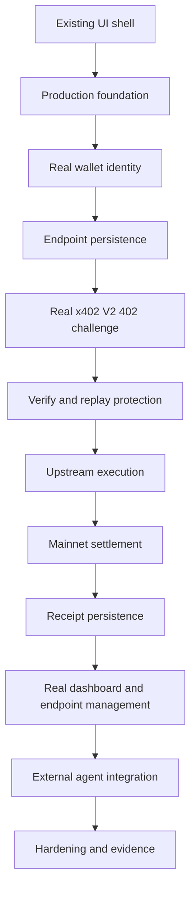

# Metron Mainnet Build Plan

> **Status:** Target implementation plan. The current repository has a UI shell and presentation previews, not the production gateway described below.

This plan starts from the existing UI shell. It does not rebuild the UI first, and it does not define a testnet transaction as done. The first production proof is a real Celo Mainnet x402 V2 settlement with persisted evidence.

## Current repository baseline

The following presentation work already exists:

- Landing, dashboard, endpoint, settings, transaction, and proxy preview pages.
- Call Line and Metron Receipt presentation components.
- Empty, unavailable, and local state copy that avoids fabricating activity.
- A proxy page at `app/p/[...proxy]/page.tsx` that renders a presentation preview, not a gateway route.

The following production capabilities do **not** exist yet:

- Production API route handlers.
- PostgreSQL/Supabase schema, migrations, or transaction persistence.
- Redis/Upstash integration.
- Wallet identity, signature authentication, or session persistence.
- x402 V2 integration, facilitator client, or Celo Mainnet provider.
- USDC pricing, `payTo` routing, or creator payout routing.
- Attribution runtime or transaction evidence ingestion.
- Real dashboard data, analytics, or endpoint management.

Do not replace these gaps with mock transactions, fake earnings, a fallback verifier, fake API data, or a test-only behavior that can reach production.

## Canonical production target

| Field | Value |
|---|---|
| Network | Celo Mainnet |
| Chain ID | `42220` |
| CAIP-2 | `eip155:42220` |
| Primary token | USDC |
| USDC decimals | `6` |
| USDC contract | `0xcEBA9300f2b948710d2653dD7B07f33A8B32118C` |
| x402 version | V2 |
| Scheme | `exact` |
| Dashboard | `https://x402.celo.org` |
| Facilitator API | `https://api.x402.celo.org` |

Use integer USDC base units as strings at protocol boundaries and integer-compatible database values. Do not use floating point for price, amount, earnings, or comparison logic.

Canonical headers:

- `PAYMENT-REQUIRED` on the `402 Payment Required` response.
- `PAYMENT-SIGNATURE` on the caller's signed retry.
- `PAYMENT-RESPONSE` on the server response.

`X-PAYMENT`, `X-Payment`, and `X-PAYMENT-RECEIPT` may appear only in an explicitly scoped legacy compatibility note. They are not the target protocol surface.

V2 header values are Base64-encoded JSON objects: `PaymentRequired`, `PaymentPayload`, and `SettlementResponse`. Configure the Celo Mainnet USDC price with an integer string amount, the canonical asset address, and `extra: { name: "USDC", version: "2" }`.

## Phase 0: Preserve the UI shell

This is the starting point, not a reason to rebuild presentation work.

- [x] Keep the existing landing and dashboard presentation structure.
- [x] Keep preview labels and unavailable values honest.
- [ ] Add no live-looking values until they come from persisted production records.
- [ ] Document every UI surface that is waiting for a real backend boundary.

**Exit evidence:** The current shell remains a presentation layer and makes no claim that a wallet, request, response, settlement, or receipt exists.

## Phase 1: Production foundation

Implement the server foundation before wiring product screens to data.

- [ ] Create the PostgreSQL/Supabase connection and Drizzle schema source.
- [ ] Generate and apply migrations with `drizzle-kit generate` and `drizzle-kit migrate` when schema work begins. Never use `drizzle push`.
- [ ] Create the Redis/Upstash client for ephemeral state only.
- [ ] Define environment validation and server-only module boundaries.
- [ ] Configure the Celo Mainnet chain and a production RPC/provider for server-side evidence lookup.
- [ ] Configure the facilitator base URL as `https://api.x402.celo.org`.
- [ ] Keep the dashboard URL `https://x402.celo.org` out of backend API configuration.
- [ ] Store `X402_API_KEY` only in server-side deployment secrets.

Redis is for nonce/replay locks, rate limits, route caching, and auth/session nonces. PostgreSQL/Supabase is the persistent source of truth for creators, routes, payment attempts, lifecycle states, and evidence.

**Exit evidence:** A deployable server can reach the intended Mainnet facilitator API and database without exposing secrets to the browser. `/verify` availability alone is not accepted as settlement readiness.

## Phase 2: Real wallet identity

Implement identity before allowing endpoint ownership or settlement configuration.

- [ ] Connect a wallet on Celo Mainnet.
- [ ] Require a nonce-bound wallet signature for authentication.
- [ ] Verify the signature server-side and issue a secure session.
- [ ] Persist the authenticated wallet identity in PostgreSQL/Supabase.
- [ ] Prevent one session from managing another creator's routes.
- [ ] Keep the registered agent/payTo wallet distinct from an arbitrary creator wallet until routing is implemented.

The registered wallet is `0x21E5Fc03E4305CC8CFb874253c6d66A8bdB0bcDa`. Its role in the eventual `payTo` path is not silently assumed by this plan.

**Exit evidence:** A real wallet can authenticate, the server can authorize an owner-scoped request, and no browser code receives `X402_API_KEY`.

## Phase 3: Endpoint persistence and policy

Create the first persistent product object: a route configuration.

- [ ] Persist endpoint name, slug, upstream URL, active state, owner, and timestamps.
- [ ] Persist the payment asset, network, scheme, integer USDC amount, and selected `payTo` destination.
- [ ] Validate upstream URLs and block SSRF targets, private networks, localhost, and unsupported protocols.
- [ ] Ensure a route cannot be published until its payment policy is complete.
- [ ] Define ownership and authorization for create, update, disable, and delete operations.
- [ ] Decide whether a route can be creator-direct, platform-directed, or a configured split path. Mark the choice **REQUIRES IMPLEMENTATION DECISION** until implemented.

Do not describe a creator wallet as receiving Track 2 credit merely because it is shown in a form. Track 2 attribution depends on the registered wallet actually being involved in the settlement path.

**Exit evidence:** A route can be created and retrieved from persistent storage with a complete, Mainnet-compatible payment policy, but no payment is claimed yet.

## Phase 4: Real x402 V2 challenge

Implement the gateway request boundary after route persistence exists.

- [ ] Add the production gateway route for `/p/:slug/*`; do not repurpose the current preview page as a payment handler.
- [ ] Resolve the route from PostgreSQL with safe cache invalidation.
- [ ] Return `402 Payment Required` when the caller has not supplied a valid payment payload.
- [ ] Encode the payment requirements in the `PAYMENT-REQUIRED` header.
- [ ] Use `scheme: "exact"`, `network: "eip155:42220"`, USDC's exact Mainnet address, integer `amount`, and the chosen `payTo` address.
- [ ] Include only requirements that the server can actually verify and settle.
- [ ] Parse `PAYMENT-SIGNATURE` on the retry and reject malformed or incompatible x402 versions.
- [ ] Treat legacy `X-PAYMENT` variants only as a separately tested compatibility path, never as the canonical flow.

**Exit evidence:** A real request receives a real V2 `PAYMENT-REQUIRED` challenge whose requirements match the persisted route policy. No settlement occurs in this phase.

## Phase 5: Verification and upstream execution

Keep authorization, verification, and execution separate.

- [ ] Send the x402 V2 payment payload and requirements to `POST https://api.x402.celo.org/verify`.
- [ ] Treat `/verify` as an open verification endpoint; do not attach or expose settlement credentials in the browser.
- [ ] Check the response against the route's network, exact scheme, asset, amount, destination, payer, and time window.
- [ ] Acquire a single-use nonce/replay lock in Redis before upstream work.
- [ ] Record `PAYMENT_REQUIRED` and then `VERIFIED` lifecycle state in persistent storage for the payment attempt.
- [ ] Forward the original request to the upstream only after verification and route authorization.
- [ ] Strip payment protocol headers from the upstream request unless the upstream explicitly requires a documented pass-through.
- [ ] Record upstream status and failure reason without inventing a successful response.

If upstream work fails before settlement, do not call `/settle`. Record `UPSTREAM_FAILED`, return the appropriate upstream/gateway error, and describe the attempt as aborted and non-settled. Do not claim an automatic refund or reversal.

**Exit evidence:** A real verified authorization reaches a real upstream endpoint, and a forced upstream failure produces no settlement request.

## Phase 6: First real Celo Mainnet settlement

This is the critical path and the first payment milestone.

- [ ] Test `GET /supported` and `GET /health` against `https://api.x402.celo.org`.
- [ ] Test `POST /verify` with a real compatible V2 payload.
- [ ] Test `POST /settle` separately with a server-side `X402_API_KEY` sent as the facilitator's `X-API-Key` header.
- [ ] Confirm that the key is never present in browser requests, bundles, logs, or client-visible errors.
- [ ] Invoke `/settle` only after the selected upstream success policy is satisfied.
- [ ] Persist the facilitator response, lifecycle result, and transaction hash when available.
- [ ] Verify the resulting transaction on Celo Mainnet using an independent source.
- [ ] Return `PAYMENT-RESPONSE` with the real settlement response.

The first real settlement must use Celo Mainnet, chain ID `42220`, and USDC. A testnet run may be a development preflight, but it cannot be the definition of done or the final proof.

The exact relationship between upstream delivery and settlement response must be implemented and documented. A failed settlement must not be represented as settled.

**Exit evidence:** One genuine caller authorization produces one genuine Celo Mainnet settlement, a persisted transaction hash, and a reproducible request/response trace.

## Phase 7: Receipt persistence and real dashboard data

Connect the existing shell to evidence, not placeholders.

- [ ] Persist transaction/call records using integer USDC base units.
- [ ] Support lifecycle states: `PAYMENT_REQUIRED`, `VERIFIED`, `UPSTREAM_FAILED`, `SETTLEMENT_FAILED`, and `SETTLED` (or a documented equivalent).
- [ ] Persist payer, route, asset, network, amount, `payTo`, upstream status, facilitator response, failure reason, timestamps, and transaction hash when available.
- [ ] Make writes idempotent for retries and repeated facilitator responses.
- [ ] Display only records returned from persistent storage.
- [ ] Compute earnings and counts from eligible real records; do not seed or synthesize analytics.
- [ ] Show unavailable evidence explicitly instead of displaying a fabricated hash, wallet, amount, or timestamp.

**Exit evidence:** The dashboard reflects the real Mainnet settlement and remains empty when no real record exists.

## Phase 8: Endpoint management and external agent integration

- [ ] Connect create/list/update/disable/delete UI actions to authenticated API routes.
- [ ] Generate route URLs from persisted route identifiers.
- [ ] Provide an x402 V2 example for an external caller or agent using `PAYMENT-REQUIRED` and `PAYMENT-SIGNATURE`.
- [ ] Test an external agent against a live Metron route rather than a local state selector.
- [ ] Show the real `PAYMENT-RESPONSE` and receipt evidence after the call.
- [ ] Keep all external examples aligned with `eip155:42220`, `exact`, and USDC Mainnet.

**Exit evidence:** An external caller can discover the requirement, sign the retry, receive a real response, and inspect the persisted result.

## Phase 9: Hardening

- [ ] Add strict SSRF protection and upstream response limits.
- [ ] Enforce replay protection atomically with Redis TTLs.
- [ ] Add wallet, IP, route, and facilitator rate limits with abuse-safe defaults.
- [ ] Redact payment payloads, signatures, API keys, and private upstream credentials from logs.
- [ ] Protect dashboard routes with owner-scoped authorization and secure session cookies.
- [ ] Add timeout, cancellation, and idempotency behavior for upstream and settlement calls.
- [ ] Define how `SETTLEMENT_FAILED` is retried or reconciled; do not silently retry without a durable policy.
- [ ] Add monitoring for facilitator health, verification failures, settlement failures, upstream failures, and evidence gaps.
- [ ] Add tests for invalid signatures, replayed payloads, wrong network, wrong asset, wrong amount, wrong destination, upstream failure, settlement failure, and missing server key.

No runtime fallback verifier is acceptable in production.

## Phase 10: Hackathon evidence and submission

### Primary: Track 2 Most x402 Payments

- [ ] Count successful Celo Mainnet x402 settlements, not payment amount.
- [ ] Ensure the registered agent/payTo wallet is actually involved in the settlement path, as the payer or payTo destination; settlements to or from that wallet are attributable only when it participates.
- [ ] Keep real settlement hashes and wallet-attribution evidence.
- [ ] Do not require `celo_91fed90b97fc` on facilitator relayer settlements; the FAQ says the relayer cannot carry Metron's tag.
- [ ] Do not claim every facilitator settlement carries the tag.
- [ ] Do not send tagged mirror transactions.

### Secondary: Track 1 Most Revenue Generated

- [ ] Use the exact assigned tag `celo_91fed90b97fc` on genuine direct transactions sent by the agent.
- [ ] Preserve existing builder codes with the supported multi-code form.
- [ ] Keep transaction hashes and decode/verify attribution evidence.
- [ ] Exclude fake volume, self-transfers, wash activity, and sybil traffic.
- [ ] Mark hosted facilitator Builder Code/ERC-8021 support **REQUIRES OFFICIAL CONFIRMATION** rather than assuming it.

## Dependency order



Do not parallelize work across a boundary that has not established its contract. UI wiring can begin after the persistence/API contracts are agreed, but it cannot manufacture data while those contracts are absent.

## Definition of done

- [ ] A real wallet identity is authenticated and persisted.
- [ ] A real endpoint is persisted with a complete Mainnet USDC payment policy.
- [ ] An unpaid request receives HTTP `402` with `PAYMENT-REQUIRED`.
- [ ] A caller retries with `PAYMENT-SIGNATURE` and Metron verifies it through the production facilitator API.
- [ ] Upstream execution and settlement are separate, observable steps.
- [ ] At least one successful settlement occurs on Celo Mainnet through the exact x402 flow.
- [ ] `/settle` has been tested separately with a server-side `X402_API_KEY`.
- [ ] The transaction hash and lifecycle record are persisted and independently verifiable.
- [ ] The dashboard displays real receipt data and no fabricated analytics.
- [ ] An external caller or agent completes the flow.
- [ ] Failure tests prove that an upstream failure is aborted and non-settled.
- [ ] Submission evidence preserves the Track 1 and Track 2 separation.

## Target environment variables

Names are implementation targets, not values to commit:

```env
DATABASE_URL=
UPSTASH_REDIS_REST_URL=
UPSTASH_REDIS_REST_TOKEN=
X402_FACILITATOR_API_URL=https://api.x402.celo.org
X402_API_KEY=
CELO_MAINNET_RPC_URL=
NEXT_PUBLIC_CELO_CHAIN_ID=42220
```

`X402_API_KEY` and any private RPC/provider credentials must remain server-side. Never put them in `NEXT_PUBLIC_*` variables.

## Unresolved implementation decisions

- **`payTo` routing:** Creator-direct, registered agent wallet, or another explicitly configured destination. **REQUIRES IMPLEMENTATION DECISION.** The current UI does not implement any choice.
- **Settlement and delivery order:** Define the exact response behavior for settlement success/failure after upstream execution. **REQUIRES IMPLEMENTATION DECISION.**
- **Track 1 facilitator attribution:** Hosted facilitator support for Metron's Builder Code/ERC-8021 path. **REQUIRES OFFICIAL CONFIRMATION.**
- **Settlement reconciliation:** Define durable retry/reconciliation behavior for `SETTLEMENT_FAILED`. **REQUIRES IMPLEMENTATION DECISION.**

## References

- [Celo x402](https://docs.celo.org/build-on-celo/build-with-ai/x402)
- [Celo network overview](https://docs.celo.org/build-on-celo/network-overview)
- [Celo stablecoin contracts](https://docs.celo.org/tooling/contracts/stablecoin-contracts)
- [x402 HTTP 402 and V2 headers](https://docs.x402.org/core-concepts/http-402)
- [x402 Builder Code extension](https://docs.x402.org/extensions/builder-code)
- [Celo Builders FAQ](https://celobuilders.xyz/hackathons/agentic-payments-defai/faqs)
- [Celo Builders tracks](https://celobuilders.xyz/hackathons/agentic-payments-defai/tracks)
