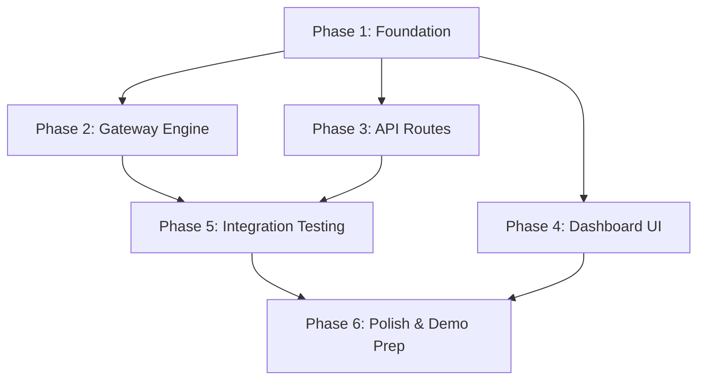

# Metron: 48-Hour Build Plan

This is the 48-hour build plan for **Metron** — a zero-code x402 payment gateway for APIs on Celo. This plan is optimized for parallel AI coding agents.

## 1. Pre-Build Setup (Hour 0-2)
Checklist of everything that needs to be ready before coding:
- [ ] Supabase project created, connection string ready
- [ ] Upstash Redis instance created, credentials ready
- [ ] Celo Alfajores testnet wallet funded with test CELO + USDC
- [ ] `x402.celo.org/supported` endpoint tested to confirm Alfajores support
- [ ] Next.js project initialized (already exists at `c:\Users\USER\Documents\ideas\celo-agentic-hack`)
- [ ] Install dependencies (see Section 8)
- [ ] Drizzle config file created (`drizzle.config.ts`)
- [ ] Environment variables configured (`.env.local`)

## 2. Build Phases (Parallelizable)

### Phase 1: Foundation (Hour 2-6) — SEQUENTIAL (must be first)
- **Database schema** (`lib/db/schema.ts`): Drizzle tables for `developers`, `proxy_routes`, and `transactions`.
- **Database migration**: Run `npx drizzle-kit generate` and `npx drizzle-kit migrate`.
- **Redis client setup** (`lib/redis.ts`): Initialize Upstash Redis client.
- **x402 facilitator client** (`lib/x402.ts`): Wrappers for `x402.celo.org/verify` and `x402.celo.org/settle`.
- **Attribution tags utility** (`lib/attribution.ts`): Integration with `@celo/attribution-tags`.
- **Wallet config** (`lib/wagmi.ts`): Wagmi + Celo chains configuration (Alfajores).
- **Base layout + providers** (`app/layout.tsx`): Add `WagmiProvider`, `QueryClientProvider`, and `RainbowKitProvider`.

### Phase 2: Gateway Engine (Hour 6-14) — Can start after Phase 1
This is the CORE product. Implement the proxy handler at `app/p/[...proxy]/route.ts`:
- **Request router**: Parse the slug from the URL, lookup the route config from the database.
- **402 Challenge**: If no `X-PAYMENT` header is present, return HTTP 402 with payment requirements.
- **Payment parser**: Extract and decode the `X-PAYMENT` header.
- **Verify**: Call `x402.celo.org/verify` to ensure the payment is valid.
- **Nonce check**: Verify the nonce hasn't been used yet via Redis (`SETNX`).
- **Upstream proxy**: Forward the request to the target API, ensuring payment headers are stripped.
- **Response validator**: Check that the upstream returned a 2xx status.
- **Settle or refund**: Call `x402.celo.org/settle` ONLY if 2xx, skip/refund if error.
- **Meter**: Log the transaction to PostgreSQL (`transactions` table).
- **Respond**: Return the upstream API response + `X-PAYMENT-RECEIPT` header.

### Phase 3: API Routes (Hour 6-10) — Can run PARALLEL with Phase 2
Implement at `app/api/endpoints/route.ts` and `app/api/transactions/route.ts`:
- **POST `/api/endpoints`** — Create endpoint (authed by wallet signature).
- **GET `/api/endpoints`** — List creator's endpoints.
- **PATCH `/api/endpoints/:id`** — Update endpoint.
- **DELETE `/api/endpoints/:id`** — Delete endpoint.
- **GET `/api/transactions`** — List transactions.
- **GET `/api/stats`** — Earnings summary.
- **Wallet-based auth middleware**: Verify wallet signature for protected API routes (SIWE).

### Phase 4: Dashboard UI (Hour 10-20) — Can run PARALLEL with Phase 2
Implement using Shadcn UI and Tailwind CSS:
- **Landing page** (`app/page.tsx`): Hero section, how it works, CTA.
- **Dashboard layout** (`app/dashboard/layout.tsx`): Sidebar nav, wallet connection status.
- **Overview page** (`app/dashboard/page.tsx`): Total earnings, total calls, recent transactions.
- **Endpoints page** (`app/dashboard/endpoints/page.tsx`): List existing, create new, toggle on/off.
- **New endpoint form** (`components/NewEndpointForm.tsx`): Paste URL, set price, get proxy URL.
- **Endpoint detail page** (`app/dashboard/endpoints/[id]/page.tsx`): Analytics, SDK snippets, proxy URL.
- **Transactions page** (`app/dashboard/transactions/page.tsx`): Table view with filters.
- **SDK snippet generator component** (`components/SnippetGenerator.tsx`): curl, TypeScript, and Python examples.

### Phase 5: Integration Testing (Hour 20-30) — SEQUENTIAL after Phase 2+3
- **Set up a test API**: e.g., a Next.js API route (`app/api/test-weather/route.ts`) returning mock data.
- **Register it**: Register it as a Metron endpoint.
- **Test the full flow**:
  1. Call proxy URL without payment → get 402.
  2. Sign payment with test wallet.
  3. Call with `X-PAYMENT` header → get response + receipt.
  4. Verify transaction logged in DB.
  5. Verify settlement on Celo Alfajores explorer.
- **Test failure cases**:
  1. Invalid signature → 402 rejected.
  2. Replayed nonce → 409 rejected.
  3. Upstream 500 → payment NOT settled.
  4. Insufficient balance → 402 rejected.

### Phase 6: Polish & Demo Prep (Hour 30-48) — SEQUENTIAL after Phase 5
- **Fix bugs** found in testing.
- **Dashboard UI polish**: Add animations, loading states, and empty states.
- **Create demo script**:
  1. Show empty dashboard.
  2. Register a real API endpoint.
  3. Show generated proxy URL and SDK snippets.
  4. Run an AI agent that calls the endpoint.
  5. Watch the payment settle on Celo.
  6. Show earnings appear in dashboard.
- **Record demo video** or prepare live demo.
- **Write `README.md`**.
- **Deploy to Vercel**.
- **Submit to hackathon**.

## 3. Dependency Graph


## 4. Agent Assignment Strategy
Recommend how to split work across parallel coding agents:
- **Agent A**: Phase 1 → Phase 2 (Foundation + Gateway — the critical path). Focuses on Drizzle, Postgres, Redis, and proxy logic.
- **Agent B**: Phase 3 (API Routes). Can start once the schema is done. Focuses on backend CRUD and wallet auth.
- **Agent C**: Phase 4 (Dashboard UI). Can start once layout/providers are done. Focuses on Shadcn UI, frontend components, and state.
- **Coordinator**: Phase 5 + 6 (Integration testing + polish). Manages testing, bug fixing, demo recording, and deployment.

## 5. Risk Register
| Risk | Impact | Mitigation |
|---|---|---|
| **x402 Facilitator Issues** | High - Blocks payment flow | Build robust error handling; have a fallback mock verifier for local testing. |
| **Wallet Auth Complexity** | Medium - Delays dashboard | Use standardized SIWE libraries or Viem's `verifyMessage`. |
| **Proxy Latency** | Medium - Slows API requests | Use Vercel Edge functions for `app/p/[...proxy]/route.ts` and Upstash Redis. |
| **Scope Creep (UI)** | Medium - Wastes hackathon time | Stick strictly to Shadcn UI defaults. Prioritize the gateway engine. |

## 6. Definition of Done
Clear checklist for what 'done' means:
- [ ] Developer can connect wallet and register an API endpoint
- [ ] Proxy URL works: returns 402 without payment, returns response with payment
- [ ] Payments verified via `x402.celo.org` on Celo Alfajores
- [ ] Payments settled on-chain only after upstream success
- [ ] Failed upstream calls do NOT trigger settlement
- [ ] Dashboard shows earnings and transaction history
- [ ] Attribution tags attached to all settlements
- [ ] Deployed to Vercel
- [ ] Demo video or live demo ready
- [ ] README.md complete

## 7. Environment Variables
```env
NEXT_PUBLIC_WALLETCONNECT_PROJECT_ID=
NEXT_PUBLIC_CELO_CHAIN_ID=44787
DATABASE_URL=
UPSTASH_REDIS_REST_URL=
UPSTASH_REDIS_REST_TOKEN=
X402_FACILITATOR_URL=https://x402.celo.org
ATTRIBUTION_ADDRESS=
```

## 8. Dependency Install Command
```bash
# Core backend and blockchain dependencies
npm install drizzle-orm postgres wagmi viem @rainbow-me/rainbowkit @celo/attribution-tags @upstash/redis nanoid

# Development dependencies
npm install -D drizzle-kit

# UI initialization (Shadcn)
npx shadcn@latest init
npx shadcn@latest add button input table card dialog form label
```
