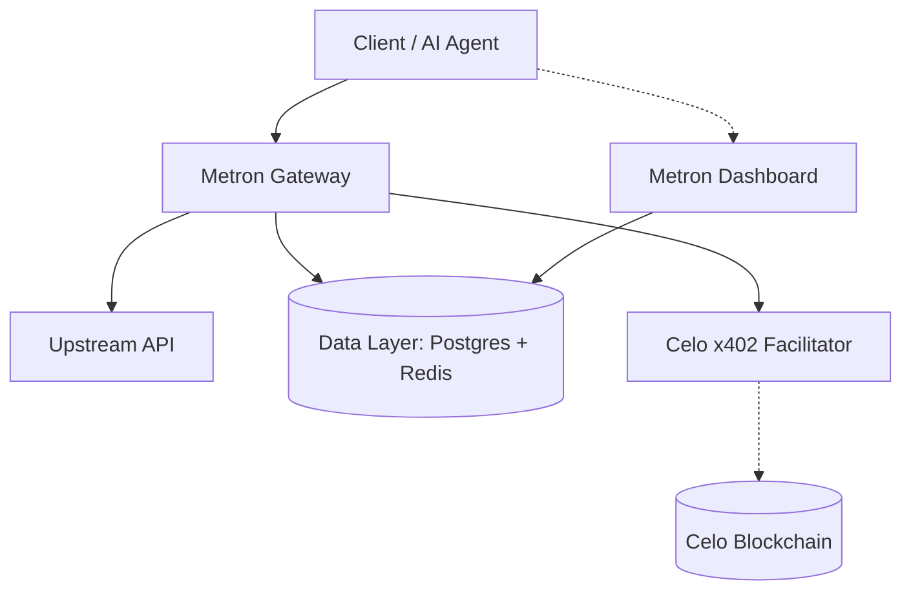
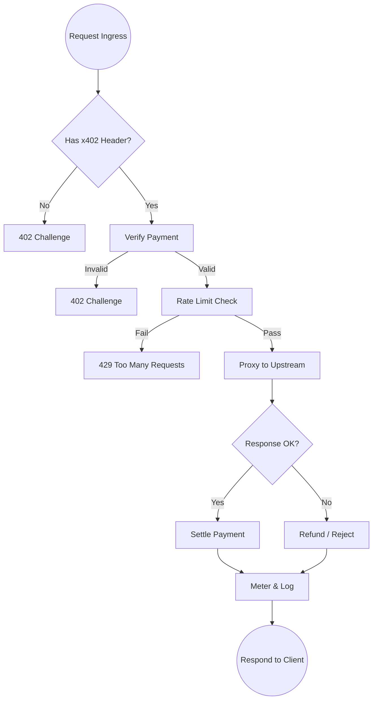
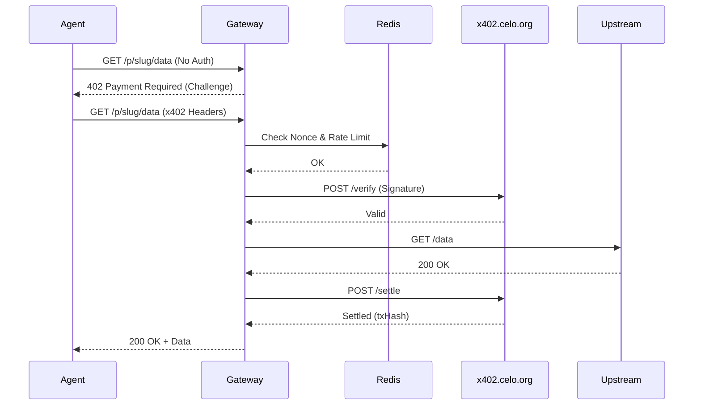

# Metron: System Architecture and Database Schema

This document outlines the system architecture and database schema for **Metron**, a zero-code x402 payment gateway for APIs on Celo. It is designed to be comprehensive and implementation-ready for coding agents.

---

## 1. System Overview

Metron acts as a reverse proxy gateway that sits between API consumers (human callers or AI agents) and upstream developer APIs. It enforces a pay-per-request model using the Celo x402 protocol, ensuring that every request is paid for with stablecoins (USDC) before being forwarded to the upstream service.

### 4 System Layers
1. **Client Layer:** AI agents, automated scripts, or end-users initiating HTTP requests to Metron-powered proxy URLs.
2. **Metron Gateway:** The core system (Next.js App Router). It handles routing, 402 Payment Required challenges, payment verification via x402, rate limiting, request metering, and proxying to the upstream API.
3. **Celo Blockchain Layer:** Facilitates the actual settlement of funds via Celo's x402 facilitator and on-chain transactions, optionally tracking attribution via ERC-8021 tags.
4. **Data Layer:** Persistent storage (PostgreSQL via Supabase) for configurations, user accounts, and transaction records, alongside a fast cache (Redis via Upstash) for nonces and rate limiting.

### Component List with Responsibilities
- **Metron Dashboard:** A frontend interface for developers to authenticate (wallet connection), configure API endpoints, set pricing, and view earnings.
- **Gateway Proxy Handler:** A catch-all API route that intercepts traffic, challenges unpaid requests, verifies paid requests, and forwards traffic.
- **Nonce Manager:** Tracks request nonces in Redis to prevent replay attacks.
- **Payment Verifier:** Communicates with the Celo x402 facilitator to verify off-chain signatures and on-chain settlements.
- **Database Client (Drizzle):** Interacts with PostgreSQL to store route configs and log successful/failed transactions.

---

## 2. Tech Stack

- **Framework:** Next.js 15 (App Router) for frontend, API routes, and the proxy handler.
- **Language:** TypeScript throughout.
- **Persistence:** Drizzle ORM + PostgreSQL (Supabase).
- **Caching & Ephemeral State:** Redis (Upstash) for caching, nonces, and rate limiting.
- **Wallet & Web3:** Wagmi + Viem + RainbowKit for Celo wallet connection.
- **Payment Protocol:** Celo x402 facilitator API (`x402.celo.org`).
- **Attribution:** `@celo/attribution-tags` (ERC-8021).
- **UI:** Shadcn UI + Tailwind CSS for the developer dashboard.

---

## 3. Architecture Diagrams

### 3a. System Layers



### 3b. Gateway Request Flow



### 3c. Sequence Diagram (Hot Path)



### 3d. Developer Onboarding Flow

```mermaid
flowchart LR
    Connect[Connect Wallet] --> URL[Paste Upstream URL]
    URL --> Price[Set Price (USDC)]
    Price --> Deploy[Deploy Route]
    Deploy --> SDK[Get Proxy URL & Snippets]
```

---

## 4. Project File Structure

```text
app/
  layout.tsx
  page.tsx                    — Landing page
  dashboard/
    layout.tsx                — Dashboard layout (authenticated)
    page.tsx                  — Overview/stats
    endpoints/
      page.tsx                — List endpoints
      new/
        page.tsx              — Create new endpoint
      [id]/
        page.tsx              — Endpoint detail + analytics
    transactions/
      page.tsx                — Transaction history
    settings/
      page.tsx                — Wallet & account settings
  api/
    endpoints/
      route.ts                — CRUD for endpoints
      [id]/
        route.ts              — Single endpoint operations
    transactions/
      route.ts                — List transactions
    stats/
      route.ts                — Earnings summary
  p/
    [...proxy]/
      route.ts                — THE PROXY GATEWAY (catch-all)
lib/
  db/
    schema.ts                 — Drizzle schema definitions
    index.ts                  — Drizzle client
    migrations/               — Generated migrations
  x402/
    client.ts                 — x402.celo.org facilitator client
    verify.ts                 — Payment verification logic
    settle.ts                 — Settlement logic
    challenge.ts              — 402 challenge response builder
  gateway/
    proxy.ts                  — Upstream proxy forwarding
    nonce.ts                  — Nonce management (Redis)
    meter.ts                  — Request metering & logging
    rate-limit.ts             — Rate limiting
  attribution/
    tags.ts                   — @celo/attribution-tags wrapper
  wallet/
    config.ts                 — Wagmi + Celo chain config
  utils/
    crypto.ts                 — Signature helpers
    errors.ts                 — Error types
    sdk-generator.ts          — Generate SDK snippets
components/
  ui/                         — Shadcn components
  dashboard/
    stats-cards.tsx
    transaction-table.tsx
    endpoint-card.tsx
    endpoint-form.tsx
    earnings-chart.tsx
  wallet/
    connect-button.tsx
  proxy/
    sdk-snippet.tsx
```

---

## 5. Database Schema (Drizzle ORM)

The `nonces` table is optionally defined here, but for production, nonces should primarily reside in Redis (Upstash) with a TTL to reduce database write load. Tracking nonces in PostgreSQL is provided as a fallback/audit mechanism.

**File:** `lib/db/schema.ts`

```typescript
import { pgTable, text, timestamp, boolean, bigint, integer, uuid, uniqueIndex } from 'drizzle-orm/pg-core';
import { sql } from 'drizzle-orm';

export const developers = pgTable('developers', {
  id: uuid('id').primaryKey().defaultRandom(),
  walletAddress: text('wallet_address').notNull().unique(),
  displayName: text('display_name'),
  createdAt: timestamp('created_at').defaultNow().notNull(),
  updatedAt: timestamp('updated_at').defaultNow().notNull(),
});

export const proxyRoutes = pgTable('proxy_routes', {
  id: uuid('id').primaryKey().defaultRandom(),
  developerId: uuid('developer_id').references(() => developers.id).notNull(),
  upstreamUrl: text('upstream_url').notNull(),
  slug: text('slug').notNull().unique(),
  pricingModel: text('pricing_model').default('flat').notNull(), // 'flat', 'per_token', 'tiered'
  priceMicroUsdc: bigint('price_micro_usdc', { mode: 'number' }).notNull(),
  allowedTokens: text('allowed_tokens').array().default(sql`ARRAY['USDC']::text[]`).notNull(),
  isActive: boolean('is_active').default(true).notNull(),
  description: text('description'),
  createdAt: timestamp('created_at').defaultNow().notNull(),
  updatedAt: timestamp('updated_at').defaultNow().notNull(),
});

export const transactions = pgTable('transactions', {
  id: uuid('id').primaryKey().defaultRandom(),
  routeId: uuid('route_id').references(() => proxyRoutes.id).notNull(),
  callerWallet: text('caller_wallet').notNull(),
  amountMicroUsdc: bigint('amount_micro_usdc', { mode: 'number' }).notNull(),
  token: text('token').notNull(),
  txHash: text('tx_hash'),
  status: text('status').notNull(), // 'verified', 'settle_pending', 'settled', 'refunded', 'failed'
  upstreamStatusCode: integer('upstream_status_code'),
  latencyMs: integer('latency_ms'),
  attributionTag: text('attribution_tag'),
  nonce: text('nonce').notNull(),
  createdAt: timestamp('created_at').defaultNow().notNull(),
});

// Note: Redis is preferred for nonces due to high write-throughput and automatic TTL.
// This table is for fallback/audit purposes if Redis is not strictly enforced.
export const nonces = pgTable('nonces', {
  nonce: text('nonce').primaryKey(),
  callerWallet: text('caller_wallet').notNull(),
  usedAt: timestamp('used_at').defaultNow().notNull(),
  expiresAt: timestamp('expires_at').notNull(),
});
```

---

## 6. External Service Integration

### x402.celo.org Facilitator
The core integration handling Celo stablecoin micropayments.
- **POST `/verify`**: Called by the gateway proxy handler before forwarding the request. Checks if the provided cryptographic signature and headers match the requested payment conditions.
- **POST `/settle`**: Called *after* a successful upstream response (HTTP 20x). Instructs the facilitator to execute the on-chain settlement, moving funds from the caller to the developer.
- **GET `/supported`**: Used by the dashboard to show available chains and tokens (e.g., Celo, USDC).
- **Error Handling**: Network failures on `/settle` enqueue the settlement for retry. If `/verify` fails, the gateway responds with `402 Payment Required` or `401 Unauthorized`.

### @celo/attribution-tags (ERC-8021)
Transactions pushed to the network (via settlement) include specific calldata tags to track volume for the hackathon and ecosystem metrics. 
- Integrated in the `lib/attribution/tags.ts` wrapper.
- Extracted tags are logged in the `transactions.attributionTag` field.

### Redis (Upstash)
- **Nonce Tracking:** Redis `SETNX` (Set if Not eXists) with an expiration (TTL of 5-15 minutes) is used to prevent replay attacks of x402 payment headers.
- **Route Config Caching:** Database queries for `proxyRoutes` based on the URL `slug` are cached to ensure sub-millisecond latency for the proxy hot path.
- **Rate Limiting:** IP and wallet-based sliding window rate limit counters to protect the proxy from abuse.

---

## 7. Security Considerations

- **Nonce Replay Protection:** A strictly enforced Redis cache logs every processed nonce. If a request arrives with an already seen nonce, it is immediately rejected with a 401/402.
- **Upstream URL Validation (SSRF Prevention):** The dashboard enforces strict URL validation when creating routes. Internal IP addresses, localhost, and non-HTTP(S) protocols are explicitly blocked.
- **Rate Limiting Strategy:** Rate limits apply at two levels: IP-based (general abuse) and wallet-based (payment spam).
- **Wallet Authentication for Dashboard:** Developer login utilizes SIWE (Sign-In with Ethereum/Celo) to issue secure session cookies for dashboard API routes, ensuring they only manage routes they own.

---

## 8. Error Handling Matrix

| Scenario | HTTP Status | Settlement | User Message |
|----------|-------------|------------|--------------|
| Missing x402 Headers | `402 Payment Required` | None | `"Payment required. See WWW-Authenticate headers."` |
| Invalid/Expired Signature | `401 Unauthorized` | None | `"Invalid or expired payment signature."` |
| Nonce Reused (Replay) | `401 Unauthorized` | None | `"Nonce already used. Generate a new payment."` |
| Route Slug Not Found | `404 Not Found` | None | `"API endpoint not found."` |
| Rate Limit Exceeded | `429 Too Many Requests`| None | `"Too many requests. Please slow down."` |
| Upstream 5xx Error | `502 Bad Gateway` | Refund/Abort | `"Upstream API error. Payment aborted."` |
| Upstream Timeout | `504 Gateway Timeout` | Refund/Abort | `"Upstream API timed out. Payment aborted."` |
| Settlement Network Error | `200 OK` (Async) | Retry Queue| N/A (Response sent, settlement retried in background) |
| Successful Request | `200 OK` | Settled | (Upstream Response Body) |
