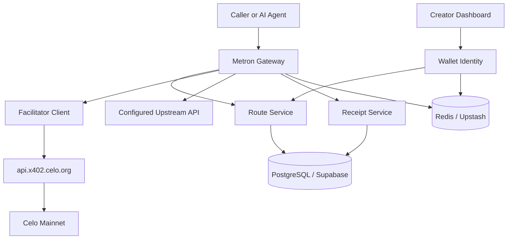
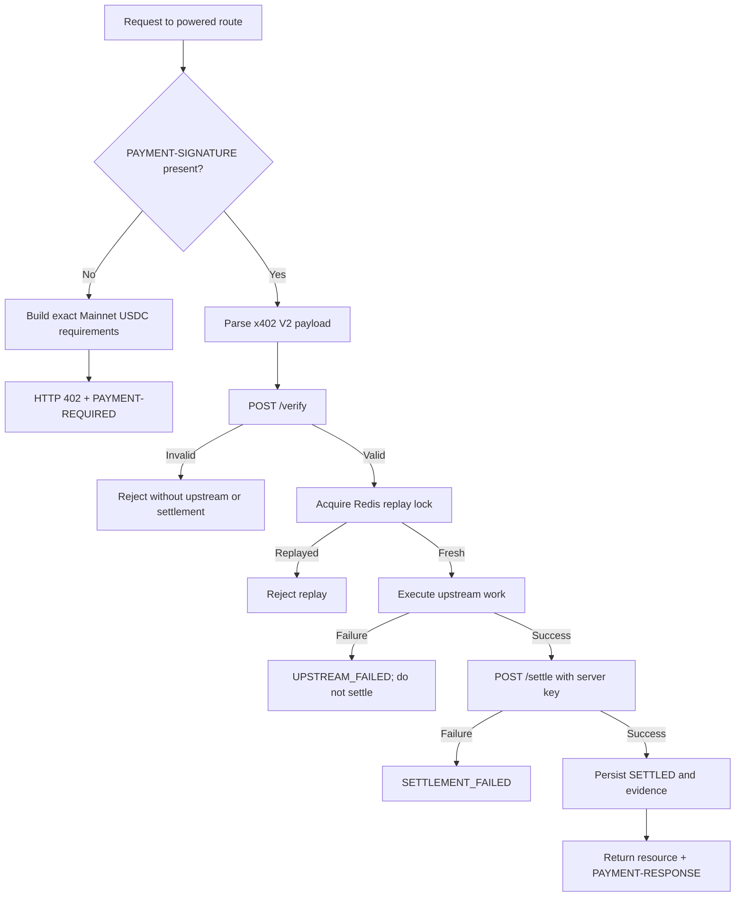
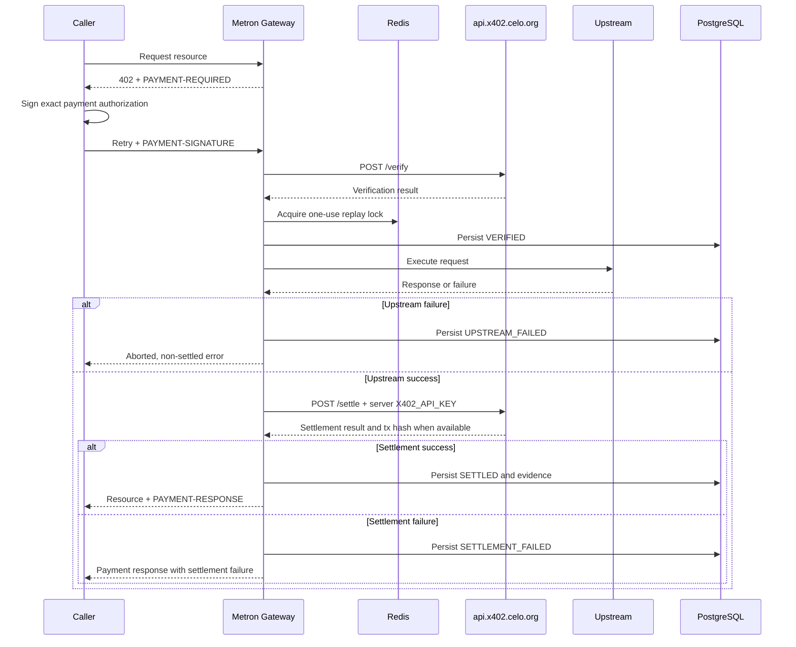

# Metron System Architecture and Database Schema

> **Status:** Target architecture. It is implementation-ready guidance, not a description of deployed behavior. The current repository has a UI shell and presentation previews only.

## 1. Current implementation boundary

Inspection of the repository shows:

- Landing, dashboard, endpoint, settings, transaction, and proxy presentation pages.
- Local state selectors and empty states that explicitly avoid real payment claims.
- No production API route handlers.
- No PostgreSQL/Supabase schema, migrations, or transaction persistence.
- No Redis/Upstash integration.
- No wallet authentication or session provider.
- No x402 facilitator client or Celo Mainnet provider.
- No USDC payment integration, `payTo` routing, attribution runtime, or transaction evidence ingestion.

The current `app/p/[...proxy]/page.tsx` renders a presentation preview. It is not a payment gateway and must not be described or reused as one without a separate production route boundary.

No fake transaction, mock earnings, fake API data, or runtime fallback verifier is acceptable in production.

## 2. Canonical production constants

| Field | Value |
|---|---|
| Network | Celo Mainnet |
| Chain ID | `42220` |
| CAIP-2 network | `eip155:42220` |
| Primary token | USDC |
| USDC decimals | `6` |
| USDC address | `0xcEBA9300f2b948710d2653dD7B07f33A8B32118C` |
| x402 version | V2 |
| Scheme | `exact` |
| Dashboard | `https://x402.celo.org` |
| Production facilitator API | `https://api.x402.celo.org` |

Use integer USDC base units. Amounts should be strings at JSON and x402 boundaries and integer-compatible values in PostgreSQL. Floating point must not be used for payment amounts, pricing comparisons, earnings, or settlement accounting.

Canonical x402 V2 headers:

- `PAYMENT-REQUIRED`: server to caller on an HTTP `402 Payment Required` response.
- `PAYMENT-SIGNATURE`: caller to server on the signed retry.
- `PAYMENT-RESPONSE`: server to caller with the settlement response.

`X-PAYMENT`, `X-Payment`, and `X-PAYMENT-RECEIPT` are legacy compatibility names only when a separately scoped migration path requires them. They are not canonical.

Each V2 header value is Base64-encoded JSON: `PaymentRequired`, `PaymentPayload`, or `SettlementResponse`, matching the header direction above. The Celo Mainnet USDC price object must use an integer string amount, the canonical asset address, and `extra: { name: "USDC", version: "2" }` for the EIP-712 domain.

## 3. System responsibilities

Metron separates five responsibilities:

1. **Authorization:** The caller signs an x402 payment authorization.
2. **Verification:** Metron asks the facilitator whether the authorization satisfies the route requirements.
3. **Execution:** Metron calls the configured upstream after verification.
4. **Settlement:** Metron asks the facilitator to settle according to the selected policy.
5. **Delivery:** Metron returns the upstream resource and the actual `PAYMENT-RESPONSE`.

The current product target is a reverse proxy around callable APIs. It is not yet a live payment system.

## 4. Target architecture layers

### Client layer

Human callers, external applications, and AI agents request a powered route. They must be able to parse x402 V2 headers without a dashboard account.

### Metron application layer

- **Dashboard:** Route configuration, wallet identity, and receipt views. It must never hold `X402_API_KEY`.
- **Identity boundary:** Wallet signature verification and owner-scoped sessions.
- **Route service:** Persistent endpoint policies and SSRF validation.
- **Gateway handler:** x402 challenge, signed retry, verification, upstream execution, settlement policy, and delivery.
- **Facilitator client:** Server-only requests to the Celo facilitator API.
- **Receipt service:** Idempotent lifecycle and evidence persistence.

### Celo and facilitator layer

The Celo hosted facilitator API validates and settles x402 V2 payments. Settlement is submitted to Celo Mainnet by the facilitator according to its service behavior.

### Data layer

- PostgreSQL/Supabase: persistent source of truth.
- Redis/Upstash: ephemeral nonce/replay locks, rate limits, route cache, and auth/session nonces.

## 5. Target system diagram



## 6. Canonical gateway flow



If upstream work fails before settlement, the attempt is aborted and non-settled. This architecture does not claim an automatic refund or reversal. Any future recovery mechanism must be implemented, persisted, and separately documented.

### Sequence



## 7. Facilitator integration

The hosts are deliberately separate:

- `https://x402.celo.org` is the human-facing dashboard.
- `https://api.x402.celo.org` is the production backend API.

Never use the dashboard as a backend API host.

Target endpoints:

| Method | Path | Auth | Role |
|---|---|---|---|
| `GET` | `/supported` | Open | Confirm supported network and scheme pairs. |
| `GET` | `/health` | Open | Liveness check. |
| `POST` | `/verify` | Open | Verify the signed payment payload and requirements. |
| `POST` | `/settle` | Server-side `X402_API_KEY` sent as `X-API-Key` | Submit the payment authorization for settlement. |

Important operational rule: `/verify` alone does not prove that settlement is configured. A deployment must test `/settle` separately with a server-side `X402_API_KEY` sent as `X-API-Key`. The key must never be exposed to browser code, callers, logs, or client-visible errors.

The target payment requirements must use `scheme: "exact"`, `network: "eip155:42220"`, USDC's exact Mainnet address, integer `amount`, and the destination selected by the `payTo` decision.

## 8. Target project boundaries

These paths describe future implementation boundaries; they do not imply that the files currently exist.

```text
app/
  api/
    auth/                    -- wallet nonce and session boundary
    endpoints/               -- authenticated route configuration
    transactions/            -- persisted receipt queries
    stats/                   -- derived real metrics
  p/[...proxy]/route.ts      -- production gateway handler
lib/
  db/                        -- PostgreSQL client, schema, migrations
  redis/                     -- ephemeral locks, rate limits, cache
  x402/                      -- server-only facilitator client and codecs
  gateway/                   -- policy, upstream, lifecycle orchestration
  wallet/                    -- signature and session verification
  attribution/               -- direct-transaction evidence only
components/
  dashboard/                 -- existing shell wired to real APIs later
  proxy/                     -- receipt/state presentation fed by evidence
```

The implementation must preserve the existing UI language from `DESIGN.md` while keeping preview components separate from payment execution code.

## 9. Database schema target

PostgreSQL/Supabase is persistent state. The schema below is a target model and is not present in the repository yet. When it is implemented, generate and apply Drizzle migrations; never use `drizzle push`.

### `developers`

| Column | Type/constraint | Purpose |
|---|---|---|
| `id` | UUID primary key | Internal creator identity. |
| `wallet_address` | Text, normalized unique | Authenticated wallet identity. |
| `created_at` | Timestamp | Creation evidence. |
| `updated_at` | Timestamp | Last identity change. |

Do not treat this wallet as the settlement destination unless the `payTo` decision selects and implements that behavior.

### `proxy_routes`

| Column | Type/constraint | Purpose |
|---|---|---|
| `id` | UUID primary key | Route identity. |
| `developer_id` | UUID foreign key | Owner scope. |
| `slug` | Text unique | Public route reference. |
| `upstream_url` | Text | Validated target endpoint. |
| `amount_base_units` | Bigint, not null | Integer USDC amount. |
| `asset_address` | Text, not null | Canonical Mainnet USDC address. |
| `network` | Text, not null | `eip155:42220`. |
| `scheme` | Text, not null | `exact`. |
| `pay_to` | Text, not null after policy selection | Settlement destination. |
| `is_active` | Boolean | Route availability. |
| `created_at` | Timestamp | Route creation. |
| `updated_at` | Timestamp | Last policy change. |

### `transactions`

This table records a call/payment attempt and its evidence. It must not be populated by a UI preview.

| Column | Type/constraint | Purpose |
|---|---|---|
| `id` | UUID primary key | Call/payment attempt identity. |
| `route_id` | UUID foreign key | Route used. |
| `caller_wallet` | Text nullable until verified | Payer identity from the verified payload. |
| `amount_base_units` | Bigint, not null | Integer payment amount. |
| `asset_address` | Text, not null | Payment asset. |
| `network` | Text, not null | Payment network. |
| `scheme` | Text, not null | x402 scheme. |
| `pay_to` | Text, not null | Destination used by the requirement. |
| `nonce` | Text nullable/audit value | Correlation value; replay enforcement lives in Redis. |
| `status` | Controlled text value | Lifecycle state. |
| `upstream_status_code` | Integer nullable | Upstream result. |
| `tx_hash` | Text nullable | Real Celo transaction hash when available. |
| `facilitator_response` | JSONB nullable | Sanitized response evidence. |
| `failure_reason` | Text nullable | Operator-readable failure. |
| `verified_at` | Timestamp nullable | Verification evidence. |
| `settled_at` | Timestamp nullable | Settlement evidence. |
| `created_at` | Timestamp | Attempt creation. |
| `updated_at` | Timestamp | Last lifecycle update. |

Required lifecycle values:

- `PAYMENT_REQUIRED`
- `VERIFIED`
- `UPSTREAM_FAILED`
- `SETTLEMENT_FAILED`
- `SETTLED`

An implementation may add states such as `DELIVERY_FAILED` or `RECONCILIATION_REQUIRED`, but it must preserve the distinction between verification and settlement.

There is no requirement for a persistent `nonces` table in the hot path. Redis owns the short-lived replay lock; PostgreSQL may retain the nonce as audit metadata after a record exists.

## 10. Redis responsibilities

Redis/Upstash is ephemeral support infrastructure, not the persistent source of truth.

Allowed uses:

- Atomic nonce/replay lock with a bounded TTL.
- Wallet-auth/session nonce with expiration.
- IP, wallet, route, and facilitator rate-limit counters.
- Route configuration cache with explicit invalidation.
- Short-lived request correlation or idempotency locks.

Do not use Redis as the only record of settlement, earnings, transaction hash, route ownership, or hackathon evidence.

## 11. API and data flow rules

### Unpaid request

1. Resolve an active route.
2. Construct the exact Mainnet USDC requirements.
3. Persist or correlate a `PAYMENT_REQUIRED` attempt without inventing a transaction.
4. Return HTTP `402 Payment Required` and `PAYMENT-REQUIRED`.

### Signed retry

1. Parse `PAYMENT-SIGNATURE` as x402 V2.
2. Verify the payload against the route policy through `/verify`.
3. Acquire the Redis replay lock atomically.
4. Persist `VERIFIED` only after the facilitator confirms verification.

### Upstream and settlement

1. Execute upstream work only after verification and replay protection.
2. If upstream fails, persist `UPSTREAM_FAILED`, do not call `/settle`, and return an aborted/non-settled result.
3. If upstream succeeds, call `/settle` with the server key according to policy.
4. Persist `SETTLED` only after a successful facilitator response and retain `tx_hash` when available.
5. Persist `SETTLEMENT_FAILED` when settlement does not complete; never report it as settled.
6. Return `PAYMENT-RESPONSE` containing the actual settlement result.

## 12. Security requirements

- Validate and constrain every upstream URL to prevent SSRF.
- Block localhost, private address ranges, metadata endpoints, redirects to blocked targets, and unsupported protocols.
- Enforce one-use payment nonces with atomic Redis operations.
- Bind route management to an authenticated wallet session.
- Keep `X402_API_KEY` and provider credentials server-only.
- Redact signed payloads, tokens, cookies, and upstream secrets from logs.
- Bound upstream request/response size and execution time.
- Rate-limit verification and settlement calls.
- Make transaction persistence and facilitator retries idempotent.
- Do not treat a facilitator health check or `/verify` response as settlement proof.
- Do not add a mock or fallback verifier to production paths.

## 13. Error and lifecycle matrix

| Scenario | Target HTTP result | Lifecycle | Settlement |
|---|---|---|---|
| Route not found/inactive | `404` | No payment attempt or rejected attempt | None |
| Missing payment signature | `402` + `PAYMENT-REQUIRED` | `PAYMENT_REQUIRED` | None |
| Malformed/invalid signature | Payment rejection | No `VERIFIED` state | None |
| Replayed authorization | Payment rejection | Rejected replay | None |
| Facilitator verification unavailable | Gateway error | Verification failure | None |
| Upstream failure before settlement | Upstream/gateway error | `UPSTREAM_FAILED` | Do not call `/settle` |
| Facilitator settlement failure | Gateway error | `SETTLEMENT_FAILED` | Not settled |
| Successful settlement | Upstream response with `PAYMENT-RESPONSE` | `SETTLED` | Real settlement evidence |

The exact status code and body for each rejection must be tested against the chosen x402 server implementation. No error message may claim a refund or reversal unless that behavior is implemented and evidenced.

## 14. Attribution and hackathon evidence

Registered project details:

| Field | Value |
|---|---|
| Project | Metron |
| Repository | [Devendurance/usemetron](https://github.com/Devendurance/usemetron) |
| Builder | Endurance Udoh |
| Assigned tag | `celo_91fed90b97fc` |
| Registered agent/payTo wallet | `0x21E5Fc03E4305CC8CFb874253c6d66A8bdB0bcDa` |

### Track 2

Track 2 is the count of successful Celo Mainnet x402 settlements. Wallet attribution is through the submitted agent/payTo wallet: settlements to or from that registered wallet are attributable only when the wallet actually participates in the settlement path. The hackathon FAQ says the facilitator relayer cannot carry Metron's tag. Therefore do not require the tag, claim every facilitator settlement carries it, or send tagged mirror transactions.

### Track 1

Track 1 is eligible volume from genuine direct transactions sent by Metron and carrying `celo_91fed90b97fc`. Preserve existing codes with the supported multi-code form and retain transaction hashes. Do not invent volume, self-transfer, wash, or sybil activity. Hosted facilitator Builder Code/ERC-8021 support is **REQUIRES OFFICIAL CONFIRMATION**.

## 15. Open architecture decisions

- **`payTo` routing:** Creator-direct, registered agent wallet, or another configured destination. **REQUIRES IMPLEMENTATION DECISION.**
- **Settlement/delivery order:** The target sequence is upstream work, settlement according to policy, then resource plus `PAYMENT-RESPONSE`; exact failure semantics must be implemented. **REQUIRES IMPLEMENTATION DECISION.**
- **Settlement reconciliation:** Retry, operator review, and evidence repair for `SETTLEMENT_FAILED`. **REQUIRES IMPLEMENTATION DECISION.**
- **Hosted facilitator attribution:** Builder Code/ERC-8021 support for Track 1. **REQUIRES OFFICIAL CONFIRMATION.**

## References

- [Celo x402](https://docs.celo.org/build-on-celo/build-with-ai/x402)
- [Celo network overview](https://docs.celo.org/build-on-celo/network-overview)
- [Celo stablecoin contracts](https://docs.celo.org/tooling/contracts/stablecoin-contracts)
- [x402 HTTP 402 and V2 headers](https://docs.x402.org/core-concepts/http-402)
- [x402 Builder Code extension](https://docs.x402.org/extensions/builder-code)
- [Celo Builders FAQ](https://celobuilders.xyz/hackathons/agentic-payments-defai/faqs)
- [Celo Builders tracks](https://celobuilders.xyz/hackathons/agentic-payments-defai/tracks)
